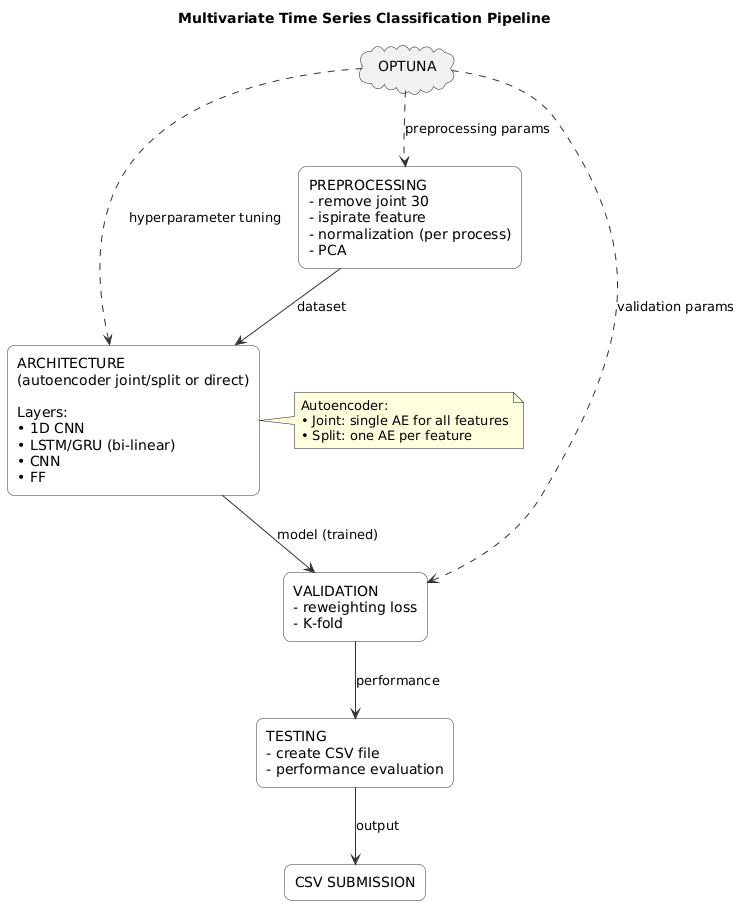

# Multivariate Time Series Classification Pipeline

This document outlines the full pipeline for a **multivariate time series classification task**.  
It includes preprocessing, model architecture options (autoencoder joint/split or direct), validation, testing, and hyperparameter optimization with Optuna.

---

## 1. Preprocessing

### Steps
- **Remove joint 30** (constant value)
- **isPirate features** ("n_hands", "n_legs", "n_eyes" have the same distribution)
- **Normalization (per process)** — standardize per feature or per sequence
- **PCA** — optional dimensionality reduction for noise removal and compact representation

### Output
A cleaned and normalized dataset ready for model input.

---

## 2. Architectures

### Options
1. **Autoencoder (Joint)**
   - Single autoencoder trained on all features together.
   - Learns shared latent representations capturing correlations between variables.

2. **Autoencoder (Split)**
   - Independent autoencoders trained per feature (or per joint).
   - Produces separate latent codes that are concatenated before classification.

3. **Direct Model**
   - No autoencoder pretraining.
   - Raw preprocessed data is fed directly into the classifier.

### Layers (possible choices)
- 1D CNN  
- LSTM / GRU (possibly bidirectional)  
- CNN  
- Feed Forward (dense layers)

---

## 3. Validation

- **Reweighting loss** to handle class imbalance  
- **K-Fold Cross Validation** to assess model generalization

Output: validation performance metrics (accuracy, F1-score, etc.)

---

## 4. Testing

- Evaluate the trained model on unseen test data  
- Generate output predictions  
- **Create CSV file** for submission

Output: `submission.csv` file containing test predictions.

---

## 5. Hyperparameter Optimization (Optuna)

**Optuna** explores different configurations of:
- Preprocessing parameters (e.g., PCA components, normalization type)
- Architecture choices (autoencoder type, layer size, dropout, etc.)
- Validation parameters (folds, weighting factors)

It automates tuning to maximize validation performance (F1-score).

---

## Overall Pipeline Diagram

