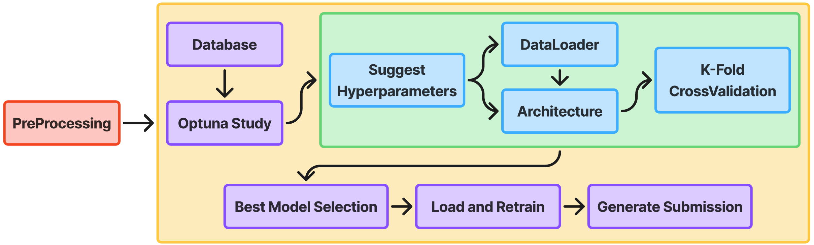

# Optimizer Module



## Description
The Optimizer module provides hyperparameter optimization capabilities integrated into **FinalPipeline**. The optimization framework uses Optuna with TPE (Tree-structured Parzen Estimator) sampling and MedianPruner for efficient hyperparameter search. It implements K-fold stratified cross-validation, returning mean validation F1-score across folds for robust model selection. The module integrates with PyTorch Lightning for training, PostgreSQL for persistent storage, and TensorBoard for logging. The optimization is fully automated within the `FinalPipeline.optuna_optimize()` and `FinalPipeline.objective_kfold()` methods.

---

## Main Classes

### `Optimizer` (Abstract Base Class)
Base class defining the interface for optimization strategies.

**Abstract Methods:**

| Method | Parameters | Returns | Description |
|--------|-----------|---------|-------------|
| `optimize` | `architecture_builder: types.FunctionType` | `Any` | Optimize the architecture builder function with hyperparameter search. |

---

### `OptunaOptimizer`
Concrete implementation of hyperparameter optimization using Optuna's TPE sampler.

**Configuration Parameters:**
- `params` (dict): Dictionary defining parameter search space with type and value ranges
- `n_trials` (int | None): Number of optimization trials to run (optional)

**Parameter Types Supported:**
- `categ`: Categorical parameters (discrete choices)
- `float`: Float parameters (continuous ranges with optional log scale)
- `int`: Integer parameters (discrete numeric ranges)

**Methods:**

| Method | Parameters | Returns | Description |
|--------|-----------|---------|-------------|
| `__init__` | - | - | Initialize OptunaOptimizer instance. |
| `optimize` | `architecture_builder: types.FunctionType`<br>`params: dict`<br>`n_trials: int \| None` | `optuna.study.Study` | Run optimization study and return results. |
| `objective` | `trial: optuna.trial.BaseTrial` | `float` | Objective function evaluated for each trial. |
| `getParams` | `params: dict`<br>`trial: optuna.trial.BaseTrial` | `dict` | Extract and interpret parameters for current trial. |

---


## Optimization Process (FinalPipeline)

### 1. Study Creation (`FinalPipeline.create_study()`)
- Creates/loads Optuna study with TPE sampler (seed=42)
- Direction: Maximize mean validation F1-score
- MedianPruner for early stopping (n_startup_trials=5, n_warmup_steps=5)
- PostgreSQL storage for persistence and resumability
- Study name: `{project_name}{study_name}`

### 2. Trial Execution (`FinalPipeline.objective_kfold()`)
For each trial:
1. **Suggest Hyperparameters**: 
   - Macro architecture (Direct/Autoencoder)
   - Encoder type (Recurrent/Conv1d/MultiScaleCNN)
   - Learning rate, regularization, dropout rates
   - Windowing parameters (window_size, stride_ratio, aggregation_method)
   - Scheduler type and parameters
   - Early stopping patience

2. **Setup Data**: DataModule with K-fold stratified splits

3. **Architecture Building**:
   - `setUpEncoder()`: Configure time series and global encoders
   - `setUpDecoder()`: Configure decoder (if Autoencoder)
   - `setUpFeedForwardHead()`: Configure classification head
   - `apply_he_initialization()`: Initialize weights

4. **K-Fold Training Loop**:
   - For each fold k=1 to K:
     - Create fresh model instance
     - Wrap with WindowedModelWrapper (if windowing enabled)
     - Train with PyTorch Lightning Trainer
     - EarlyStopping callback (monitors `val_prediction_loss`)
     - ModelCheckpoint callback (saves best per fold)
     - TensorBoard logging to `FinalPipelineLogs/`
   - Aggregate: mean_f1 = mean([F1_fold1, F1_fold2, ..., F1_foldK])

5. **Pruning Check**: MedianPruner may stop trial early if unpromising

6. **Return**: Mean validation F1-score across all K folds

### 3. Storage & Resumability
- All trials stored in PostgreSQL database
- Study can be resumed after interruption
- Checkpoints saved per trial per fold
- Trial user attributes store fold_scores, mean_f1, std_f1

### 4. Result Access
```python
pipeline.study_summary()  # Print best trials and statistics
best_params = pipeline.study.best_params
best_value = pipeline.study.best_value
pipeline.load_best_model()  # Load best checkpoint
```

---

## TPE Sampler & Search Space

### What is TPE?
Tree-structured Parzen Estimator is a Bayesian optimization algorithm that:
- Models p(h|good) and p(h|bad) separately using kernel density estimation
- Acquisition function: α(h) = p(h|good) / p(h|bad)
- Adaptively focuses on promising hyperparameter regions
- More sample-efficient than random or grid search

### FinalPipeline Configuration
- **Seed**: 42 (reproducible trial ordering)
- **Sampler**: `optuna.samplers.TPESampler(seed=42)`
- **Pruner**: `optuna.pruners.MedianPruner(n_startup_trials=5, n_warmup_steps=5, interval_steps=1)`
- **Direction**: Maximize (mean F1-score)
- **Storage**: PostgreSQL for distributed/persistent optimization

### Search Space (>10^15 configurations)

**Macro Architecture:**
- MacroArchitecture ∈ {Direct, Autoencoder}

**Encoder Configuration:**
- architectureType ∈ {Recurrent, Conv1d, MultiScaleCNN}
- If Recurrent:
  - rnnType ∈ {LSTM, GRU}
  - hiddenDim ∈ [100, 300]
  - numLayers ∈ [1, 3]
  - bidirectional ∈ {True, False}
  - recurrentDropout ∈ [0.0, 0.5]
- If Conv1d:
  - numConvLayers ∈ [1, 3]
  - kernelSize ∈ {3, 5, 7}
  - strideConv1D ∈ {1, 2}
  - convChannels_i ∈ [32, 256] per layer
  - poolType_i ∈ {max, avg} per layer
- If MultiScaleCNN:
  - numMultiScaleLayers ∈ [1, 2]
  - useDilation ∈ {True, False}
  - branchChannels ∈ [16, 128]

**Global Feature Encoder:**
- globalEmbeddingDim ∈ [16, 80]
- globalNumLayers ∈ [1, 3]
- globalDropout ∈ [0.0, 0.5]
- globalActivation ∈ {ReLU, LeakyReLU, GELU}

**Classification Head:**
- ffNumLayers ∈ [1, 4]
- ffDropout ∈ [0.0, 0.5]
- ffHiddenDim_i ∈ [64, 256] per layer

**Training Hyperparameters:**
- LearningRate ∈ [10^-5, 10^-2] (log-uniform)
- RegularizationWeight ∈ [10^-3, 10^1] (log-uniform)
- ReconstructionLossWeight ∈ [0.1, 0.9] (if Autoencoder)
- EarlyStoppingPatience ∈ [10, 20]

**Windowing:**
- use_windowing ∈ {True, False}
- window_size ∈ [5, 40]
- stride_ratio ∈ {0.25, 0.5, 0.75, 1.0}
- aggregation_method ∈ {avg_probs, avg_logits, majority_vote, max_confidence}
- window_loss_weight ∈ [0.0, 0.5]

**Scheduler:**
- SchedulerType ∈ {ReduceLROnPlateau, CosineAnnealing, CosineAnnealingWarmRestarts}
- If ReduceLROnPlateau:
  - SchedulerPatience ∈ [3, 10]
  - SchedulerFactor ∈ [0.1, 0.5]
  - SchedulerMinLR ∈ [10^-6, 10^-4] (log-uniform)
- If CosineAnnealing:
  - T_max = max_epochs
  - eta_min ∈ [10^-7, 10^-5] (log-uniform)
- If CosineAnnealingWarmRestarts:
  - T_0 ∈ [5, 20]
  - T_mult ∈ {1, 2}
  - eta_min ∈ [10^-7, 10^-5] (log-uniform)

### Advantages
- **Sample Efficiency**: ~100 trials often sufficient vs 1000s for grid search
- **Adaptive**: Learns optimal regions from completed trials
- **Robust**: Handles categorical, continuous, and conditional parameters
- **Pruning**: MedianPruner stops unpromising trials early (saves compute)
- **Persistent**: PostgreSQL enables distributed and resumable optimization

---
