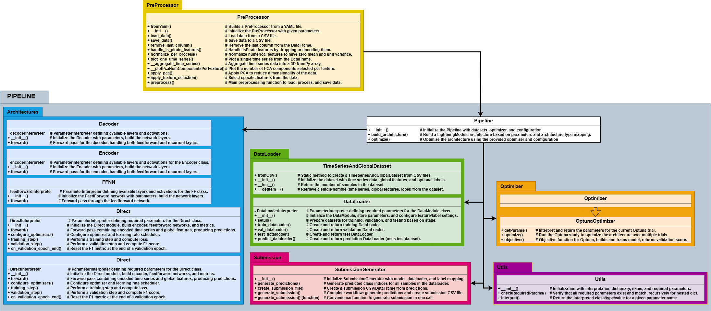

# Utils Module



## Description
The Utils module provides essential utility classes for parameter validation, feature selection, model ensembling, and configuration management across the Pipeline. It includes `ParameterInterpreter` for robust parameter validation with type checking, `FeatureSelector` for supervised feature selection in preprocessing, and `EnsembleModels` for combining multiple trained models. This module is fundamental to ensuring configuration correctness, optimizing feature spaces, and enabling advanced model combination strategies throughout the codebase.

---

## Main Classes

### `ParameterInterpreter`
Utility class for validating and interpreting configuration parameters with type checking and object mapping.

**Configuration Parameters:**
- `interpretation` (dict): Mapping from string identifiers to Python objects (classes, functions, values)
- `name` (str): Name for error messages and debugging (default: "ParameterInterpreter")
- `requiredParams` (dict): Dictionary defining required parameters with expected types or nested validation rules

**Methods:**

| Method | Parameters | Returns | Description |
|--------|-----------|---------|-------------|
| `__init__` | `interpretation: dict`<br>`name: str`<br>`requiredParams: dict` | - | Initialize interpreter with mappings and validation rules. |
| `checkRequiredParams` | `params: dict` | `None` | Validate that all required parameters are present with correct types. |
| `interpret` | `param_name: str` | `Any` | Retrieve Python object corresponding to parameter name. |

---

### `FeatureSelector`
Supervised feature selection for global features using variance thresholding, correlation filtering, Random Forest, and Mutual Information.

**Configuration Parameters:**
- `method` (str): Selection strategy ("all_three_intersection", "rf_only", "mi_only", "rf_or_mi")
- `variance_threshold` (float): Minimum variance for features (default: 0.01)
- `correlation_threshold` (float): Maximum correlation for feature pairs (default: 0.95)
- `top_k_rf` (int): Top-k features from Random Forest importance (default: 300)
- `top_k_mi` (int): Top-k features from Mutual Information (default: 300)
- `random_state` (int): Random seed for reproducibility (default: 42)

**Methods:**

| Method | Parameters | Returns | Description |
|--------|-----------|---------|-------------|
| `__init__` | `params: dict` | - | Initialize FeatureSelector with configuration. |
| `fit_transform` | `X_train: pd.DataFrame`<br>`y_train: pd.Series` | `pd.DataFrame` | Fit selector on training data and transform. |
| `transform` | `X: pd.DataFrame` | `pd.DataFrame` | Transform data using fitted selector. |
| `save_selected_features` | `path: str` | - | Save selected feature names to text file. |

**Feature Selection Pipeline:**
1. **Variance Thresholding**: Remove features with variance < threshold
2. **Correlation Filtering**: Remove highly correlated features (> threshold)
3. **Random Forest**: Rank features by importance, select top-k
4. **Mutual Information**: Rank features by MI with target, select top-k
5. **Method-based Combination**:
   - `all_three_intersection`: Features passing all three filters
   - `rf_only`: Only Random Forest top-k
   - `mi_only`: Only Mutual Information top-k
   - `rf_or_mi`: Union of RF and MI top-k features

---

### `EnsembleModels`
Utility class for combining multiple trained models into ensemble predictions.

**Configuration:**
- `models` (list[nn.Module]): List of trained PyTorch models
- `weights` (list[float], optional): Weighting for each model (default: equal)

**Methods:**

| Method | Parameters | Returns | Description |
|--------|-----------|---------|-------------|
| `__init__` | `models: list[nn.Module]`<br>`weights: list[float] \| None` | - | Initialize ensemble with models. |
| `forward` | `x: tuple` | `torch.Tensor` | Compute weighted average of model predictions. |
| `predict` | `dataloader: DataLoader` | `torch.Tensor` | Generate ensemble predictions for dataset. |

**Ensemble Strategies:**
- **Averaging**: Weighted average of softmax probabilities
- **Voting**: Majority vote across model predictions
- **Stacking**: Train meta-model on base model outputs (advanced)

**Usage in FinalPipeline:**
```python
# Load top-k models from study
top_trials = sorted(study.trials, key=lambda t: t.value, reverse=True)[:5]
models = [load_model_from_trial(t) for t in top_trials]

# Create ensemble
ensemble = EnsembleModel(models, weights=[t.value for t in top_trials])

# Generate predictions
submission_df = WindowedSubmissionGenerator(
    model=ensemble,
    dataloader=test_loader,
    label_mapping={0: "no_pain", 1: "low_pain", 2: "high_pain"}
).generate_submission()
```

---